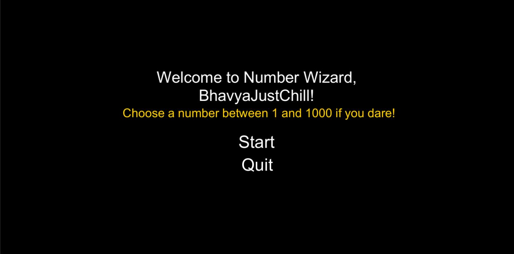
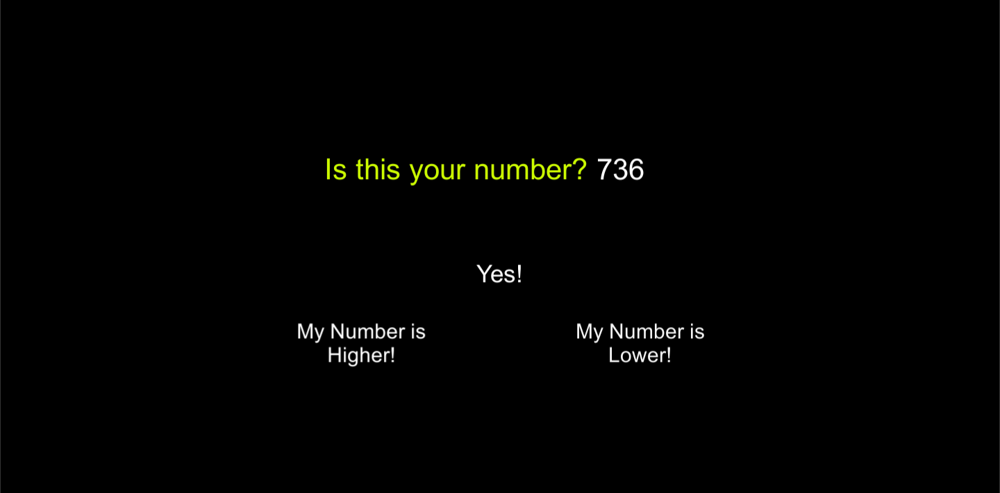
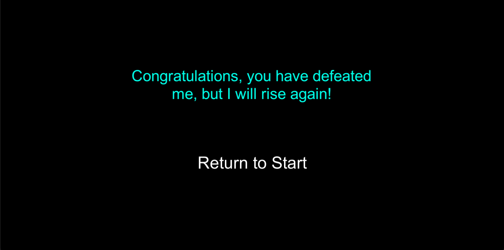

# Unity: NumberWizard (UI)
So, as I mentioned in my NumberWizard (Console) Repository, I made the NumberWizard UI.
<ul>
<li>This time it opens up in a UI</li>
<li>It has Clickable Buttons unlike PrisonEscape, where the player had to interact through Keyboard</li>
<li>This time, numbers guessed are random instead of Half of Previously Guessed Number added or subtracted</li>
<li>Now, the player can actually win if number cannot be guessed by the Computer within 15 guesses</li>
</ul>

# Screenshots

<h2>Start Screen</h2>

<h2>Game Screen</h2>

<h2>Win Screen</h2>

<h2>Lose Screen</h2>

